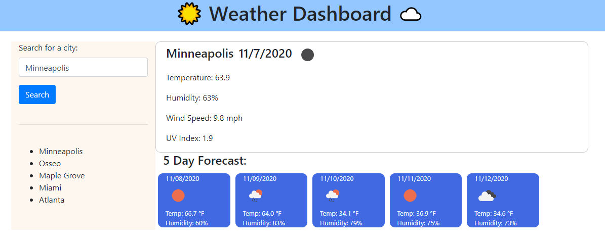

# HW6_Weather_Dashboard

### **Objective**

This assignment's objective was to use a third party API to create a weather application with dynamically updated HTML and CSS. The user is able to input a city name and the website delivers back the current weather conditions along with a 5 day forecast. When cities are searched, they populate a list below the search bar.

### **Challenges**

I began this homework thinking it wouldn't be too difficult, but came to realize there was a lot more going on than I originally thought. Setting up the AJAX and using the API to pull all the necessary information was pretty simple, where I ran in to the difficulties was with making the previously searched cities clickable and running the search again. I also was not able to get to adding the dynamic CSS color indicator on the UV Index. I believe if I had spent more time on this assignment I would've been able to figure out both of these issues, but we had started our first group project in class while I was working on this assignment and that took time away from this.

### **Link**

[See deployed page here](https://peterphenow.github.io/HW6_Weather_Dashboard/)

### **Screenshot**

### **Credits**

[OpenWeather API](https://openweathermap.org/api)

### **License**

